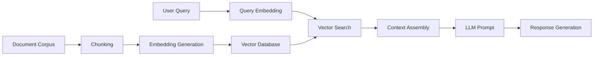

# 👋 Hello, AI World! 

<div align="center">
  
</div>


## 🤖 About Me

AI Engineer passionate about pushing the boundaries of what's possible with Generative AI and Natural Language Processing. My work focuses on developing innovative solutions that leverage the latest advancements in transformer architectures, large language models, and multimodal systems.
- 🌱 I’m currently learning **Web Scraping, GenAI, LLMs, Agentics AI & Graphs**

```python
def introduce_myself():
    me = {
        "name": "Your Name",
        "role": "AI Engineer",
        "specialties": ["Generative AI", "NLP", "LLMs", "MLOps"],
        "languages": ["Python", "PyTorch", "TensorFlow", "JAX"],
        "current_research": "Efficient fine-tuning techniques for domain-specific LLMs"
    }
    return me
```
## 💻 Tech Stack

<p align="center">
  <p>Languages</p>
  <a href="https://skillicons.dev">
    
  </a>
</p>

## 📈 My GitHub Stats

<div align="center">
  
  
</div>

## 🔍 Featured Projects

### 🤗 LLM-RAG Pipeline
[](https://github.com/your-username/llm-rag-pipeline)

A production-ready Retrieval-Augmented Generation system using vector databases and LLMs to provide accurate, context-aware responses.



### 🔄 Fine-tuning Framework
[](https://github.com/your-username/efficient-finetuning)

A framework for efficient fine-tuning of LLMs using techniques like LoRA, QLoRA, and parameter-efficient training methods.

### 🧪 LLM Evaluation Suite
[](https://github.com/your-username/llm-evaluation-suite)

Comprehensive evaluation suite for benchmarking LLMs across various dimensions including factuality, harmlessness, helpfulness, and domain-specific capabilities.

## 🌟 Interactive AI Demo

<div align="center">
  <h3>Try my latest AI demo!</h3>
  <a href="https://huggingface.co/spaces/your-username/demo">
    
  </a>
</div>

## 📫 How to Reach Me

<div>
  <a href="https://twitter.com/your-handle">
    
  </a>
  <a href="https://linkedin.com/in/your-profile">
    
  </a>
  <a href="https://your-website.com">
    
  </a>
  <a href="mailto:haihuynh.mathcs@gmail.com">
    
  </a>
</div>
